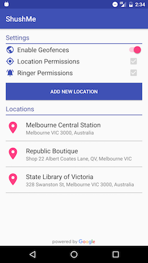

# ShushMe
Google Places API demo app

ShushMe allows you to pick a set of locations using Google's Places API, it then creates geofences around those places and turns your device into silent mode if you enter any of them. Once the device exits again ShushMe turns your device back to normal (whatever ringer mode and volume you had before entering).

## Screenshots

  
  
